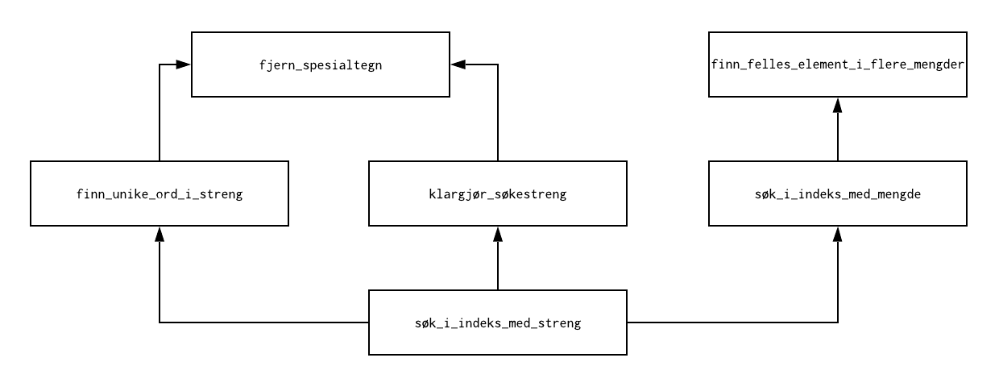

Lag din egen søkemotor
======================
I disse to obligene skal du lage din helt egne søkemotor for å søke i bøker.
Søkemotoren skal være en Python funksjon som tar to input, en søkeindeks,
og en søkestreng. Hvordan søkeindeksen er bygd opp står beskrevet senere.
Det denne søkemotorfunksjonen (``søk_i_indeks_med_streng``) skal gjøre er
å finne de indekserte bøkene som inneholder alle ordene i søkestrengen.
Nedenfor er et eksempel, hvor vi søker etter strengen 
``Sherlock holmes, scarlet``. Ut får vi mengden med bøker som inneholder
alle disse tre ordene.

>>> søk_i_indeks_med_streng(søkeindeks, "Sherlock holmes, scarlet")
{'Chronicles_of_Martin_Hewitt.bok', 'The_Hound_of_the_Baskervilles.bok'}

I andre del av oppgaven skal dere lage en slik søkeindeks fra en mappe med
mange bøker i.

Hva trenger dere for denne oppgaven
-----------------------------------
I mappen "bøker" ligger en rekke bøker som tekstfiler. Disse er hentet fra 
`Project Gutenberg`_. Din jobb er å lage et verktøy som lar brukeren skrive
inn en søkestreng. Programmet skal så printe filnavnene til bøkene som 
inneholder alle ordene i søkestrengen. 

.. _Project Gutenberg: http://www.gutenberg.org/

For å gjøre dette trenger du tre verktøy vi har lært om i forelesning:
    * Dictionary
    * Mengder (set)
    * Strenger

I tillegg kommer vi til å bruke Path_ objektet i Python for å 
iterere over alle bokfilene.

.. _Path: https://docs.python.org/3/library/pathlib.html#pathlib.Path

Hvordan skal dere arbeide med denne oppgaven
--------------------------------------------

Last ned zip filen som inneholder oppgaven, i den filen ligger det
en fire Python-filer: ``indeks_søk.py``, ``lag_indeks.py``,
``__init__.py`` og ``ferdig_indeks.py``. Dere skal kun modifisere
``indeks_søk.py`` og ``lag_indeks.py``. ``__init__.py`` er der for
å gjøre jobben vår lettere, mens ``ferdig_indeks`` inneholder kode 
som laster inn en ferdig søkeindeks slik at dere kan søke i en
indeks før dere har lagd kode for å lage deres egen søkeindeks.
I tillegg ligger en mappe med bokfiler i ``bøker`` mappa, disse
bokfilene skal dere indeksere selv. 

En søkeindeks
-------------
Søkemotoren er basert på en indeks som må bygges først. Å lage denne indeksen
kan ta litt tid, men når indeksen er bygd en gang er det veldig raskt å søke
etter ord. La oss starte med å forklare hvordan indeksen er bygd opp.

Vår søkeindeks skal bestå av nøkkel-verdi par hvor hver nøkkel er unike
ord (f.eks. ``"sherlock"``). Hver verdi er filnavnet til alle bøkene som
innehodler det ordet (f.eks. 
``{'Chronicles_of_Martin_Hewitt.txt', 'The_Hound_of_the_Baskervilles.txt', 'In_the_Fog.txt'}``
).
             

Å slå opp i en søkeindeks
-------------------------
Når vi slår opp i en søkeindeks bruker vi en søkestreng. Eksempel på dette
er ``"Holmes, hounds"``. I vår indeks skal vi kun bruke små bokstaver og
ingen spesialtegn, derfor må vi transformere søkestrengen slik at disse fjernes.
Da vil eksempel strengen vår se slik ut: ``"holmes hounds"``. Når strengen
kun inneholder ord på samme format som søkeindeksen vår deler vi strengen
opp i en liste med ord. I vårt eksempel blir det ``["holmes", "hounds"]``.
Så slår vi opp i indeksen vår etter disse ordene og får en mengde for hvert
ord. I vårt eksempel får vi disse mengdene:

| ``{'Chronicles_of_Martin_Hewitt.txt', 'The_Hound_of_the_Baskervilles.txt', 'In_the_Fog.txt'}``
| og 
| ``{'The_Hound_of_the_Baskervilles.txt', 'Martin_Hewitt_Investigator.txt'}``

Det søkemotoren skal gi ut er snittet (intersection) av disse mengdene, det vil 
si mengden av elementer som er del av alle (begge i dette tilfellet) mengdene. 
I vårt eksempel er det singleton mengden:

``{'The_Hound_of_the_Baskervilles.txt'}``

Å utvide en søkeindeks
----------------------
La oss se for oss at vi har en søkeindeks. Altså en dictionary hvor hver nøkkel
er enkeltord og verdiene er mengden av alle tekstfiler hvor enkeltordene
dukker opp. La oss videre se for oss at vi vil legge til en ny tekstfil
i denne indeksen.

For å legge til en ny tekstfil i en indeks må vi først lage en mengde med 
alle ord som oppstår i filen. For hvert ord i denne mengden så gjør vi dette

  * Sjekk om ordet allerede er en nøkkel i indeksen.
     * Hvis ordet er en nøkkel i indeksen: 
         Legg til det nåværende filnavnet til den korresponderende mengden.
     * Hvis ordet ikke er en nøkkel i indeksen:
         Lag et nytt nøkkel-verdi par i indeksen hvor nøkkelen er ordet og
         verdien er en mengde som kun inneholder det nåværende filnavnet.

Å lage en ny søkeindeks
-----------------------
Når vi lager en ny søkeindeks så starter vi med en tom dictionary. Dette
er startsindeksen vår. Deretter itererer vi over alle filene vi ønsker å
indeksere og legger de til i søkeindeksen vår.

Funksjoner dere skal lage
=========================
Her har dere en liste med funksjoner dere skal lage. Det anbefales at
dere oppretter funksjoner i rekkefølge slik de er skrevet her. Grunnen
til det er at senere funksjoner bygger på de du har lagd tidligere.

I *Notes* delene har vi skrevet hint dere kan lese hvis dere står
fast med noen oppgaver og i *Examples* delene har dere eksempel input
og output for funksjonene.

Oblig 2: Søke i en ferdig indeks
--------------------------------

.. automodule:: indeks_søk
    :members:

Funksjonskalldiagram
~~~~~~~~~~~~~~~~~~~~

Her ser dere et bilde som viser hvilke funksjoner som skal brukes i hver
funksjon dere lager. Hvis en pil starter i funksjon *a* og ender i funksjon
*b*, så skal funksjon *a* bruke funksjon *b*.

Oblig 3: Lage en søkeindeks
---------------------------

.. automodule:: lag_indeks
    :members:
